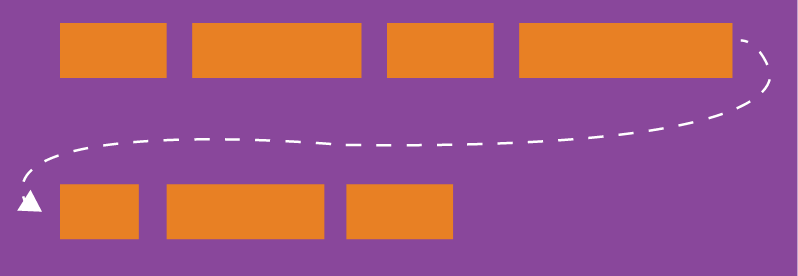

## flex-direction属性

`flex-direction`属性决定主轴的方向（即项目的排列方向）。

    .box {
        flex-direction: row | row-reverse | column | column-reverse;
    }


```
row（默认值）：主轴为水平方向，起点在左端。
row-reverse：主轴为水平方向，起点在右端。
column：主轴为垂直方向，起点在上沿。
column-reverse：主轴为垂直方向，起点在下沿。
```
### row
<div class="box direction-1">
	<div class="box-item">1</div>
	<div class="box-item">2</div>
	<div class="box-item">3</div>
	<div class="box-item">4</div>
</div>

### row-reverse
<div class="box direction-2">
	<div class="box-item">1</div>
	<div class="box-item">2</div>
	<div class="box-item">3</div>
	<div class="box-item">4</div>
</div>

<div class="dire">

<div>

### column
<div class="box box-3">
	<div class="box-item">1</div>
	<div class="box-item">2</div>
	<div class="box-item">3</div>
	<div class="box-item">4</div>
</div>
</div>

<div>

### column-reverse
<div class="box box-4">
	<div class="box-item">1</div>
	<div class="box-item">2</div>
	<div class="box-item">3</div>
	<div class="box-item">4</div>
</div></div>
</div>


## flex-wrap属性

默认情况下，项目都排在一条线（又称"轴线"）上。`flex-wrap`属性定义，如果一条轴线排不下，如何换行。



    .box{
        flex-wrap: nowrap | wrap | wrap-reverse;
    }

```
nowrap（默认）：不换行。
wrap：换行，第一行在上方。
wrap-reverse：换行，第一行在下方。
```
### nowrap
<div class="box wrap-1">
	<div class="box-item">1</div>
	<div class="box-item">2</div>
	<div class="box-item">3</div>
	<div class="box-item">4</div>
    <div class="box-item">5</div>
	<div class="box-item">6</div>
</div>

### wrap
<div class="box wrap-2">
	<div class="box-item">1</div>
	<div class="box-item">2</div>
	<div class="box-item">3</div>
	<div class="box-item">4</div>
    <div class="box-item">5</div>
	<div class="box-item">6</div>
</div>

### wrap-reverse
<div class="box wrap-3">
	<div class="box-item">1</div>
	<div class="box-item">2</div>
	<div class="box-item">3</div>
	<div class="box-item">4</div>
    <div class="box-item">5</div>
	<div class="box-item">6</div>
</div>

## flex-flow属性

`flex-flow`属性是`flex-direction`属性和`flex-wrap`属性的简写形式，默认值为`row nowrap`。

    .box {
        flex-flow: <flex-direction> || <flex-wrap>;
    }

<div class="box flow-1">
	<div class="box-item">1</div>
	<div class="box-item">2</div>
	<div class="box-item">3</div>
	<div class="box-item">4</div>
    <div class="box-item">5</div>
	<div class="box-item">6</div>
	<div class="box-item">7</div>
</div>


## justify-content属性

`justify-content`属性定义了项目在主轴上的对齐方式。

    .box {
        justify-content: flex-start | flex-end | center | space-between | space-around;
    }

它可能取5个值，具体对齐方式与轴的方向有关。下面假设主轴为从左到右。

```
flex-start（默认值）：左对齐
flex-end：右对齐
center： 居中
space-between：两端对齐，项目之间的间隔都相等。
space-around：每个项目两侧的间隔相等。所以，项目之间的间隔比项目与边框的间隔大一倍。
```
### flex-start
<div class="box justify-1">
	<div class="box-item">1</div>
	<div class="box-item">2</div>
	<div class="box-item">3</div>
	<div class="box-item">4</div>
</div>

### flex-end
<div class="box justify-2">
	<div class="box-item">1</div>
	<div class="box-item">2</div>
	<div class="box-item">3</div>
	<div class="box-item">4</div>
</div>

### center
<div class="box justify-3">
	<div class="box-item">1</div>
	<div class="box-item">2</div>
	<div class="box-item">3</div>
	<div class="box-item">4</div>
</div>

### space-between
<div class="box justify-4">
	<div class="box-item">1</div>
	<div class="box-item">2</div>
	<div class="box-item">3</div>
	<div class="box-item">4</div>
</div>

### space-around
<div class="box justify-5">
	<div class="box-item">1</div>
	<div class="box-item">2</div>
	<div class="box-item">3</div>
	<div class="box-item">4</div>
</div>


## align-items属性

`align-items`属性定义项目在交叉轴上如何对齐。

    .box {
        align-items: flex-start | flex-end | center | baseline | stretch;
    }

它可能取5个值。具体的对齐方式与交叉轴的方向有关，下面假设交叉轴从上到下。

```
flex-start：交叉轴的起点对齐。
flex-end：交叉轴的终点对齐。
center：交叉轴的中点对齐。
baseline: 项目的第一行文字的基线对齐。
stretch（默认值）：如果项目未设置高度或设为auto，将占满整个容器的高度。
```

### flex-start
<div class="box align align-1">
	<div class="box-item">1</div>
	<div class="box-item">2</div>
	<div class="box-item">3</div>
	<div class="box-item">4</div>
</div>

### flex-end
<div class="box align align-2">
	<div class="box-item">1</div>
	<div class="box-item">2</div>
	<div class="box-item">3</div>
	<div class="box-item">4</div>
</div>

### center
<div class="box align align-3">
	<div class="box-item">1</div>
	<div class="box-item">2</div>
	<div class="box-item">3</div>
	<div class="box-item">4</div>
</div>

### baseline
<div class="box align align-4">
	<div class="box-item">1</div>
	<div class="box-item item-tall">2</div>
	<div class="box-item">3</div>
	<div class="box-item item-tall">4</div>
</div>

### stretch
<div class="box align align-5">
	<div class="box-item">1</div>
	<div class="box-item">2</div>
	<div class="box-item">3</div>
	<div class="box-item">4</div>
</div>


## align-content属性

`align-content`属性定义了多根轴线的对齐方式。如果项目只有一根轴线，该属性不起作用。

    .box {
        align-content: flex-start | flex-end | center | space-between | space-around | stretch;
    }

```
flex-start：与交叉轴的起点对齐。
flex-end：与交叉轴的终点对齐。
center：与交叉轴的中点对齐。
space-between：与交叉轴两端对齐，轴线之间的间隔平均分布。
space-around：每根轴线两侧的间隔都相等。所以，轴线之间的间隔比轴线与边框的间隔大一倍。
stretch（默认值）：轴线占满整个交叉轴。
```
### flex-start
<div class="box alignC alignC-1">
	<div class="box-item">1</div>
	<div class="box-item">2</div>
	<div class="box-item">3</div>
	<div class="box-item">4</div>
	<div class="box-item">5</div>
	<div class="box-item">6</div>
	<div class="box-item">7</div>
	<div class="box-item">8</div>
</div>

### flex-end
<div class="box alignC alignC-2">
	<div class="box-item">1</div>
	<div class="box-item">2</div>
	<div class="box-item">3</div>
	<div class="box-item">4</div>
	<div class="box-item">5</div>
	<div class="box-item">6</div>
	<div class="box-item">7</div>
	<div class="box-item">8</div>
</div>

### center
<div class="box alignC alignC-3">
	<div class="box-item">1</div>
	<div class="box-item">2</div>
	<div class="box-item">3</div>
	<div class="box-item">4</div>
	<div class="box-item">5</div>
	<div class="box-item">6</div>
	<div class="box-item">7</div>
	<div class="box-item">8</div>
</div>

### space-between
<div class="box alignC alignC-4">
	<div class="box-item">1</div>
	<div class="box-item">2</div>
	<div class="box-item">3</div>
	<div class="box-item">4</div>
	<div class="box-item">5</div>
	<div class="box-item">6</div>
	<div class="box-item">7</div>
	<div class="box-item">8</div>
</div>

### space-around
<div class="box alignC alignC-5">
	<div class="box-item">1</div>
	<div class="box-item">2</div>
	<div class="box-item">3</div>
	<div class="box-item">4</div>
	<div class="box-item">5</div>
	<div class="box-item">6</div>
	<div class="box-item">7</div>
	<div class="box-item">8</div>
</div>

### stretch
<div class="box alignC alignC-6">
	<div class="box-item">1</div>
	<div class="box-item">2</div>
	<div class="box-item">3</div>
	<div class="box-item">4</div>
	<div class="box-item">5</div>
	<div class="box-item">6</div>
	<div class="box-item">7</div>
	<div class="box-item">8</div>
</div>

## **完结撒花:tada::tada::tada:**

<style src="./css/flex-container.scss" lang="scss"></style>
<style lang="stylus" scoped>

@media (max-width: $MQMobile) {
    .box-item {
        width: 75px;
        height: 75px;
        line-height: 75px;
        font-size: 24px;
        position: relative;


        &::before {
            font-size: 16px;
            position: absolute;
            top: 0px !important;
            left: 0px !important;
            color: red;
            line-height: 20px;
            margin-left: 10px;
            text-align: left;
        }
    }
}
</style>